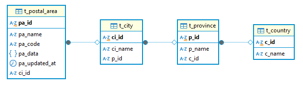

## Electricity-price-analysis

### Setup

This project uses a PostgreSQL database.

Create a `config.json` file in the root of your project with your database credentials:

```json
{
    "DB_USERNAME": "",
    "DB_PASSWORD": "",
    "DB_DATABASE": "",
    "USE_PROXY": false,
    "PROXIES": {
        "http": "socks5h://127.0.1.0:9050",
        "https": "socks5h://127.0.1.0:9050"
    },
    "PROXY_SETTING_IP": "127.0.1.0",
    "PROXY_SETTING_PORT": 9051,
    "FETCH_HEADER": {
        "User-Agent": "Mozilla/5.0 (Windows NT 10.0; Win64; x64) AppleWebKit/537.36 (KHTML, like Gecko) Chrome/114.0.0.0 Safari/537.36",
        "Accept": "application/json"
    },
    "FETCH_MIN_DELAY": 0,
    "FETCH_MAX_DELAY": 0,
    "COUNTRY_CONFIG": [
        {
            "name": "Deutschland",
            "url": "https://tibber.com/de/api/lookup/price-overview?postalCode=",
            "csv": "data/csv/deutschland.csv",
            "sep": ";",
            "province": "Bundesland",
            "city": "Ort",
            "additional": "Zusatz",
            "postal": "Plz"
        },
        {
            "name": "Niederlande",
            "url": "https://tibber.com/nl/api/lookup/price-overview?postalCode=",
            "csv": "data/csv/niederlande.csv",
            "sep": ",",
            "province": "state",
            "city": "place",
            "additional": null,
            "postal": "zipcode"
        },
        {
            "name": "Schweden",
            "url": "https://tibber.com/se/api/lookup/price-overview?postalCode=",
            "csv": "data/csv/schweden.csv",
            "sep": ",",
            "province": "state",
            "city": "place",
            "additional": null,
            "postal": "zipcode"
        },
        {
            "name": "Norwegen",
            "url": "https://tibber.com/no/api/lookup/price-overview?postalCode=",
            "csv": "data/csv/norwegen.csv",
            "sep": ",",
            "province": "state",
            "city": "place",
            "additional": null,
            "postal": "zipcode"
        }
    ]
}
```

### Database Schema
