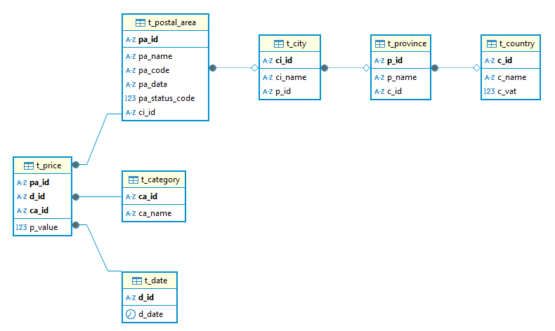

## Electricity-price-analysis

### Setup

This project uses a MSSQL database.

Create a `config.json` and `.env` files in the root of your project with your database credentials:

```json
```

```
DB_USERNAME=sa
DB_PASSWORD=XXXXXX
DB_DATABASE=strom_db
DB_HOSTNAME=localhost
DB_PORT=1433
```

https://learn.microsoft.com/en-us/sql/connect/odbc/download-odbc-driver-for-sql-server?view=sql-server-ver17


1. docker-compose up -d
2. py data_manager.py

### Database Schema
